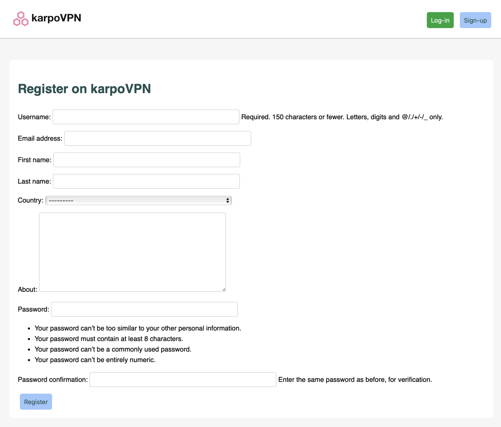
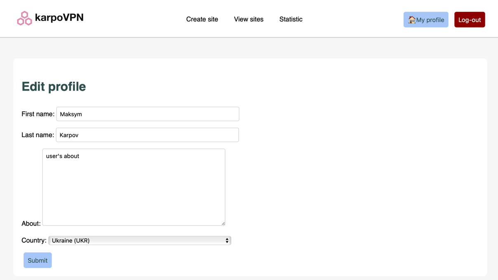
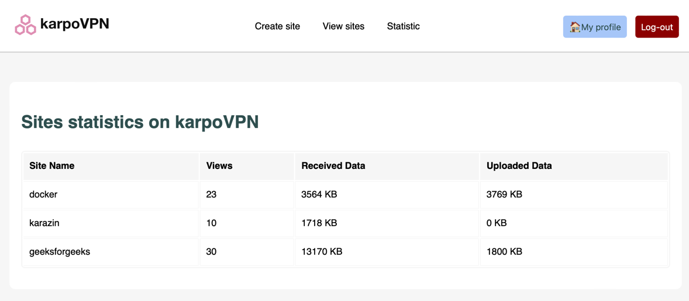
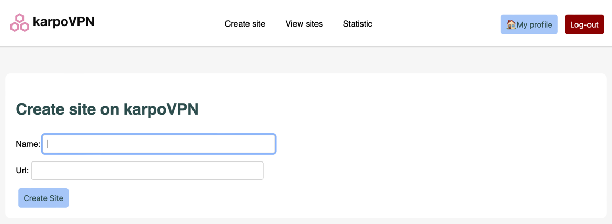
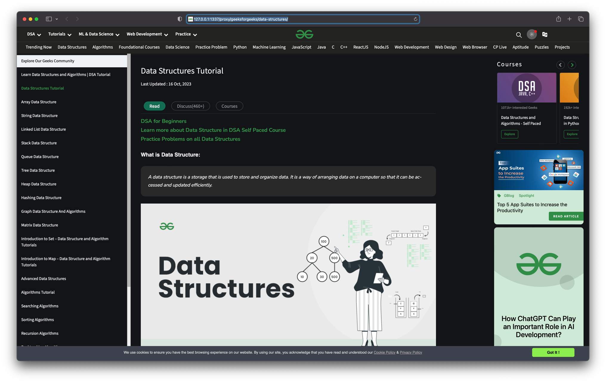

# karpoVPN

# Description

The product is a simple VPN service that allows users to browse the web 
anonymously and create their own VPN sites. All functionality is available 
through the website.

# Project overview

- Registration and login
  - Users can register on the website by providing their email address and creating a password.
  - After registration, users can log in to the website using their account.
  
- User's personal account
  - In the personal account, users can edit their personal data such as name, password, etc.
  
- VPN usage statistics 
  - In their personal account, users can view VPN usage statistics, such as the number of times they navigated between pages and the amount of data sent and downloaded through the VPN. 
  - The statistics are divided by the sites used through the VPN.
  
- Creating your own websites
  - Users can create their own websites in their personal account. Each site has a name and URL.
  - After creating a site, the user can click on the "Go to site" button and they will be redirected to the site via internal routing.
  
- A proxy server for browsing websites
  - Your app acts as an intermediary between the user and the original website.
  - When the user navigates to a page on the original site, he or she provides the name of his or her site and the path on the original site.
  - The application performs routing and forwards requests to the original site through its proxy server.
  

# Configuration

## Prerequisites

Make sure you have installed all the following prerequisites on your
development machine:

- Docker

## Configure project ready for production:

- Clone repository:

```bash  
git clone https://github.com/Maksym-Karpov/karpoVPN.git  
```    

- Move into project root folder:

 ```bash 
 cd karpoVPN/ 
 ```

- Rename the `.env.prod.example` to `.env.prod` and change with values that 
will be used by Django and 3rd party services (PSQL, Redis):

```configuration 
DJANGO_SETTINGS_MODULE=config.settings.prod

SECRET_KEY=SECRET

SQL_ENGINE=django.db.backends.postgresql
SQL_DATABASE=postgres
SQL_USER=postgres
SQL_PASSWORD=postgres
SQL_HOST=db
SQL_PORT=5432

DATABASE=postgres

REDIS_HOST=redis
REDIS_PORT=6379
REDIS_DB=0
``` 

- Rename the `.env.prod.db.example` to `.env.prod.db` and change with values that 
will be used by Docker to setup environment:


```configuration
POSTGRES_USER=postgres
POSTGRES_PASSWORD=postgres
POSTGRES_DB=postgres

REDIS_HOST=redis
REDIS_PORT=6379
REDIS_DB=0
```    

- Start up the Docker Compose service:

```bash 
 docker-compose -f docker-compose.prod.yml up -d --build 
```

- Stop the Docker Compose service:

```bash 
docker-compose -f docker-compose.prod.yml down -v 
```    


Web app will be available locally [here](http://127.0.0.1:1337/).
